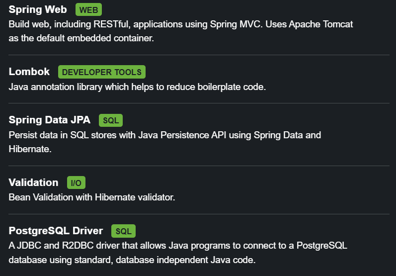

# How to start?
Go to https://start.spring.io/

| Field            | Purpose                                          |
| ---------------- | ------------------------------------------------ |
| **Group**        | Your organization or namespace (`com.mycompany`) |
| **Artifact**     | The app/module name (`user-service`)             |
| **Name**         | Human-readable app name (often same as artifact) |
| **Package name** | Java package for your code                       |

Example

```Group:        com.acme
Artifact:     order-service
Name:         Order Service
Package name: com.acme.orderservice
```
For now choose **Java 21** because it has long term support.

## Dependencies
- Spring Web Web
    - Build web, including RESTful, applications using Spring MVC. Uses Apache Tomcat as the default embedded container.
- Lombok Developer Tools
    - Java annotation library which helps to reduce boilerplate code.
- Spring Data JPA SQL
    - Persist data in SQL stores with Java Persistence API using Spring Data and Hibernate.
- Validation I/O
    - Bean Validation with Hibernate validator.
- PostgreSQL Driver SQL
    - A JDBC and R2DBC driver that allows Java programs to connect to a PostgreSQL database using standard, database independent Java code.



Then later on I can add more if I need them.

Click generate and extract in your chosen location.

# Functional requrements and Schemas

---

# 📌 Project: **Secure Expense Tracker API**

**Architecture**

* Backend-only (REST API)
* PostgreSQL
* Code-first (JPA → schema)
* Multi-user system
* Security-aware by design

---

## 1️⃣ Functional Requirements

### 👤 User & Authentication

#### User Management

* A user **can register** with:

  * email (unique)
  * password
  * full name
* A user **can log in** and receive an access token
* A user **can log out**
* A user **can update their profile**
* A user **can deactivate their account** (soft delete)

#### Roles

* System supports **roles**

  * `USER`
  * `ADMIN`
* A user **can have multiple roles**
* Roles define access to endpoints (future security layer)

---

### 💰 Expense Management

#### Expense

* A user **can create an expense**
* An expense:

  * belongs to **exactly one user**
  * belongs to **one category**
  * has an amount
  * has a currency
  * has a description
  * has a date
* A user **can update their own expenses**
* A user **can soft-delete an expense**
* A user **cannot access other users’ expenses**

---

### 🗂 Category Management

#### Category

* A user **can create custom categories**
* Categories are **user-specific**
* A category:

  * has a name
  * may have a description
* A category **cannot be deleted if it has expenses**
* Default categories exist (e.g. Food, Rent)

---

### 📊 Reporting

#### Expense Reports

* A user **can retrieve expenses**:

  * by date range
  * by category
* A user **can get monthly summaries**

  * total amount per month
  * total amount per category per month
* Reports are **read-only**
* Reports are computed from stored expenses

---

### 🔍 Querying & Pagination

* Expenses can be:

  * paginated
  * sorted (by date, amount)
  * filtered (by category, date range)
* Pagination is mandatory for list endpoints

---

### 🧾 Auditing & Metadata

* Every major entity must track:

  * creation timestamp
  * last modification timestamp
* Soft deletion is preferred over hard delete

---

## 2️⃣ Database Schema (PostgreSQL)

Below is the **conceptual schema** (not SQL, not JPA — pure design).

---

## 🧑 USERS

**users**

| Column     | Type      | Notes           |
| ---------- | --------- | --------------- |
| id         | UUID      | Primary key     |
| email      | VARCHAR   | Unique          |
| password   | VARCHAR   | Hashed          |
| full_name  | VARCHAR   |                 |
| enabled    | BOOLEAN   | Active/inactive |
| created_at | TIMESTAMP |                 |
| updated_at | TIMESTAMP |                 |

---

## 🔐 ROLES

**roles**

| Column | Type    | Notes           |
| ------ | ------- | --------------- |
| id     | UUID    | Primary key     |
| name   | VARCHAR | `USER`, `ADMIN` |

---

## 🔗 USER_ROLES (Join Table)

**user_roles**

| Column  | Type | Notes      |
| ------- | ---- | ---------- |
| user_id | UUID | FK → users |
| role_id | UUID | FK → roles |

**Relationship**

* Many-to-Many
* A user can have many roles
* A role can belong to many users

---

## 🗂 CATEGORIES

**categories**

| Column      | Type      | Notes           |
| ----------- | --------- | --------------- |
| id          | UUID      | Primary key     |
| user_id     | UUID      | FK → users      |
| name        | VARCHAR   |                 |
| description | VARCHAR   |                 |
| is_default  | BOOLEAN   | System-provided |
| created_at  | TIMESTAMP |                 |
| updated_at  | TIMESTAMP |                 |

**Relationship**

* Many categories → one user
* A user owns their categories

---

## 💰 EXPENSES

**expenses**

| Column       | Type      | Notes           |
| ------------ | --------- | --------------- |
| id           | UUID      | Primary key     |
| user_id      | UUID      | FK → users      |
| category_id  | UUID      | FK → categories |
| amount       | DECIMAL   |                 |
| currency     | VARCHAR   | ISO code        |
| description  | VARCHAR   |                 |
| expense_date | DATE      |                 |
| deleted      | BOOLEAN   | Soft delete     |
| created_at   | TIMESTAMP |                 |
| updated_at   | TIMESTAMP |                 |

---

## 🔄 Relationships Summary

```
User
 ├──< Expenses
 ├──< Categories
 └──< UserRoles >── Role
```

---

## ⚠️ Important Design Constraints (You Must Enforce Later)

These are **intentional learning triggers**:

1. **User isolation**

   * Expenses must always be filtered by owner

2. **Category integrity**

   * Category deletion blocked if expenses exist

3. **Soft delete**

   * Deleted expenses should not appear in reports

4. **Lazy vs eager loading**

   * Some relations must be lazy (you’ll discover why)

5. **Transactional operations**

   * Expense creation & updates must be atomic

---

## 🧠 What You’ll Learn From This Design

| Concept          | Where it appears          |
| ---------------- | ------------------------- |
| JPA relations    | User ↔ Expense ↔ Category |
| N+1 problem      | Listing expenses          |
| Transactions     | Expense operations        |
| Security         | User isolation            |
| DTO mapping      | API responses             |
| Pagination       | Expense lists             |
| Advanced queries | Monthly reports           |

---

## ✅ Next Step (No Code Yet)

Your next task should be:

1. Translate this schema into **entities**
2. Decide **ownership & navigation direction**
3. Decide **which relationships are bidirectional**
4. Decide **fetch strategies** (even if you guess wrong)

# Entities
## User Entity
I use UUID because:

- More memory efficient
- Type-safe (prevents invalid formats)
- Hibernate automatically handles conversion to/from database storage
- Better for database indexing and queries

For auto id generation if you are using UUID then use `@UuidGenerator` otherwise use `@GeneratedValue(strategy = GenerationType.IDENTITY)` for numeric values.

*Note to self:
(Read more about UUID)*

